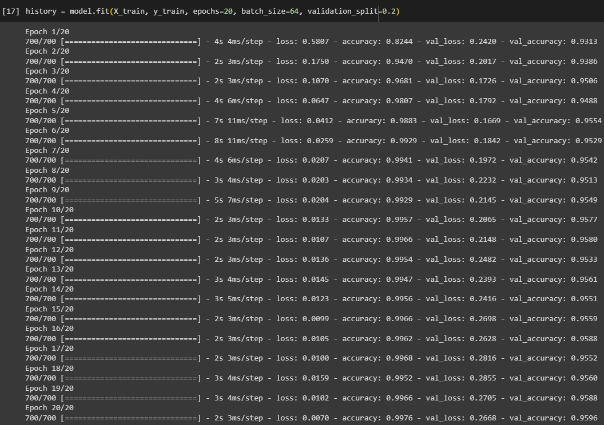

# ML-Kelompok5-3H-Ceria-Cepat-Cendikiawan

# Jobsheet 9 - Perceptron dan ANN

| No. | Nama                        | Absen | NIM
|-----|-----------------------------|-------|------------|
| 1 | Abdul Basith Bahi             | 1     | 2141720177 |
| 2 | Bagus Rezky Adhyaksa          | 7     | 2141720210 |
| 3 | Maulana Arif Wijaya           | 16    | 2141720085 |
| 4 | Muhammad Dzaka Murran Rusid   | 21    | 2141720076 |
| 5 | Sely Ruli Amanda              | 23    | 2141720005 |    

# Tugas

## Deskripsi Umum
- Lakukan klasifikasi pada data MNIST dengan menggunakan model ANN
- Anda diperbolehkan melakukan eksplorasi terhadap,
    - Metode pra pengolahan
    - Pemilihan fitur
    - Arsitektur ANN
    - Fungsi Aktiviasi
- ANN diimplementasikan dengan menggunakan tensorflow.
- DIKERJAKAN SECARA BERKELOMPOK
- JELASKAN HASIL YANG ANDA DAPATKAN,
    - AKURASI
    - CONFUSION MATRIX
    - KONFIGURASI MODEL --> MULAI DARI PRA PENGOLAHAN SAMPAI ARSITEKTUR ANN

# Jawab

## Eksplorasi Dataset


Dari hasil perhitungan jumlah data untuk masing-masing label, maka dihasilkan perbedaan jumlah data yang tidak signifikan. Hal ini menunjukkan bahwa data dianggap balance.

Selain itu untuk membuktikan bahwa data termasuk balance, maka dilakukan perhitungan seperti gambar di bawah. dengan menghitung standar deviasi, kemudian dilakukan perbandingan dengan ambang batas, yang mana ambang batas ini kami tentukan sebesar 5% dari jumlah keseluruhan data atau sebesar 3.500. Data dikatakan balance apabila nilai standar deviasi kurang dari ambang batas, yang sama artinya dengan apabila jumlah data pada masing-masing label kurang dari ambang batas, maka data dikatakan imbalance.


## Melakukan Scalling
Sebelum melakukan ekstraksi fitur dan pembuatan model, kami mengawali dengan melakukan scaling data, hal ini untuk meningkatkan performa model. Untuk scalling data, kami menggunakan MinMax Scalling. 

## Ekstraksi Fitur dengan PCA
Kami menggunakan PCA untuk melakukan ekstraksi fitur, dengan n_component sebanyak 200. Kemudian melakukan fitting data training yang telah dilakukan scalling ke dalam objek PCA, yang mana akan mengubah data training ke dalam dimensi yang lebih rendah, yaitu 200 komponen utama


## Split Dataset
Kami melakukan split data dengan rasion 80:20 dan random_state sebanyak 42.

## Flattening dan Membuat Model ANN
Flatteing digunakan untuk mengubah data ke dalam vektor satu dimensi. Hal ini berguna untuk mneyamakan format data yang awalnya memiliki tiga dimensi (karena data gambar) akan disamaratakan menjadi satu dimensi, yang kemudian berguna untuk menjadi input lapisan jaringan saraf penuh (dense layers). Selain itu juga berguna untuk hidden layer dalam ANN, yang biasanya membutuhkan inputan dalam bentuk vektor satu dimensi. 

Setelah itu membuat model sequential menggunakan 'keras.Sequential', yang memiliki tiga layer, antara lain:

- lapisan input yang memiliki jumlah neuron sebanyak n_component PCA, yaitu 200
- lapisan pertama dengan 128 neuron menggunakan aktivasi ReLU (Rectified Linear Unit). Ini adalah hidden layer pertama yang menerima masukan dari lapisan input yang telah diflatten.
- lapisan kedua dengan 64 neuron menggunakan ReLU
- lapisan output dengan 10 neuron (sesuai dengan label pada dataset) dan menggunakan aktivasi softmax. 

Penjelasan Fungsi Aktivasi

- ReLU mengonversi semua nilai negatif menjadi nol (yaitu, ReLU(x) = 0 jika x < 0) dan membiarkan nilai positif tidak berubah (yaitu, ReLU(x) = x jika x >= 0). Fungsi ini memungkinkan jaringan untuk mempelajari representasi non-linear dari data dan mengatasi masalah gradien yang menghilang (vanishing gradient). Selain itu, penggunaan ReLU pada hidden layers bertujuan untuk mempelajari fitur-fitur kompleks dalam data yang dapat digunakan untuk klasifikasi.
- Fungsi aktivasi softmax digunakan pada lapisan output dalam kasus klasifikasi multikelas. Ini mengubah keluaran jaringan menjadi distribusi probabilitas, di mana setiap unit output mewakili probabilitas bahwa sampel masukan termasuk dalam kelas tertentu. Dengan demikian, softmax adalah pilihan yang tepat untuk menghasilkan probabilitas kelas dalam tugas klasifikasi.


## Training Model
## 1. Compile Model (Menyatukan Arsitektur) ANN
Sebelum melatih model, terlebih dahulu perlu dilakukan kompilasi model ANN. 
```python
model.compile(optimizer = 'adam', loss = 'sparse_categorical_crossentropy', metrics = ['accuracy'])
```
- Untuk optimasi, kami menggunakan optimizer 'adam', yang merupakan sebuah algoritma algoritma optimasi yang digunakan untuk mengatur parameter-model selama pelatihan. 'adam' atau 'Adaptive Moment Estimation' adalah optimizer yang sangat umum digunakan dan efisien. 
- Untuk fungsi kerugian atau loss function, kami menggunakan 'sparse_categorical_crossentropy', yang digunakan untuk mengukur seberapa baik model melakukan klasifikasi. 'Sparse Categorical Crossentropy' adalah fungsi kerugian yang sesuai untuk masalah klasifikasi multikelas ketika label kelas disajikan sebagai bilangan bulat. Ini mengukur perbedaan antara prediksi model dan label yang sebenarnya dengan memperhitungkan probabilitas distribusi kelas.
- Terakhir, untuk metrik akurasi digunakan untuk mengukur kinerja model selama proses pelatihan. Dalam kode ini, kita menggunakan 'accuracy' (akurasi) sebagai metrik evaluasi. Akurasi mengukur sejauh mana model benar dalam memprediksi kelas data. Model akan mencoba meningkatkan metrik akurasi selama pelatihan.

## 2. Fitting Model
Kemudian dilakukan langkah fitting model atau melakukan pelatihan terhadap model. Di sini kami menggunakan epochs sebanyak 20, jadi model akan diiterasi 20 kali dalam proses pelatihan. Kemudian juga dibentuk kelompok-kelompok kecil dalam pelatihan model, dalam hal ini kami mengatur batch_size sejumlah 64. 



## Evaluasi
Evaluasi model digunakan untuk mengukur sejauh mana model ANN dapat melakukan prediksi dengan benar pada data yang tidak digunakan selama pelatihan, yaitu data uji atau data pengujian. Evaluasi pada data uji memberikan gambaran tentang kinerja model pada data yang belum pernah dilihat sebelumnya, sementara evaluasi pada data pelatihan mengukur sejauh mana model telah mempelajari data pelatihan. 


## Confusion Matrix

