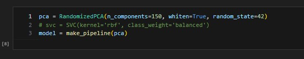
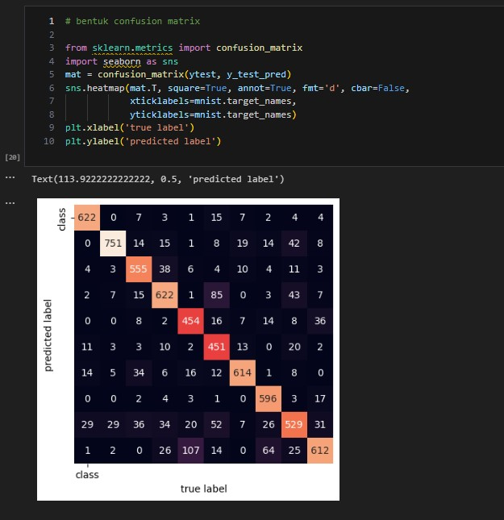

# ML-Kelompok5-3H-Ceria-Cepat-Cendikiawan

# KUIS 1

<B>KELOMPOK 5</B>

    ANNGGOTA KELOMPOK:
        1. ABDUL BASITH BAHI                       | 2141720177
        2. BAGUS REZKY                             | 2141720210
        3. MUHAMMAD DZAKA MURRAN RUSID             | 2141720076
        4. MAULANA ARIF WIJAYA                     | 2141720085
        5. SELY RULI AMANDA                        | 2141720005

# Kasus - Klasifikasi Tulisan Tangan dengan Dataset MNIST

## Deskripsi Umum
Anda diminta untuk melakukan klasifikasi dengan menggunakan algoritma Naive Bayes dan SVM untuk merekognisi tulisan tangan dari dataset MNIST

## Tentang Dataset MNIST

Dataset MNIST (Modified National Institute of Standards and Technology) merupakan dataset berupa citra grayscale dengan ukuran 28x28 yang berisi tulisan tangan dari digit angka 0-9. Jumlah data dalam dataset ini adalah 70.000 data.

## Detail Kuis

1. Pastikan jumlah data setiap label angka (0-9). Apakah terdapat data imbalance pada dataset MNIST yang digunakan? Jelaskan jawaban kelompok Anda dan buktikan!

**Jawab:**

Dari hasil perhitungan jumlah data untuk masing-masing label, maka dihasilkan perbedaan jumlah data yang cukup signifikan. Hal ini menunjukkan bahwa data dianggap imbalance. 

Selain itu untuk membuktikan bahwa data termasuk imbalance, maka dilakukan perhitungan seperti gambar di bawah. Terbukti bahwa data tidak seimbang atau imbalance. Hal ini dibuktikan dari perhitungan yang menunjukkan bahwa nilai ambang batas yaitu: **jumlah seluruh data / jumlah label** (70.000 / 10 = 7.000). Kemudian diberikan kondisi apabila jumlah data >= 7.000 maka dianggap True dan data termasuk balance, namun jika < 7.000 maka data dianggap imbalance. 

2. Tampilkan 15 buah citra pertama dari dataset MNIST berserta labelnya. Anda dapat menggunakan referensi dari Job Sheet 03.

**Jawab:**

3. Lakukan proses ekstraksi fitur pada data MNIST. Pada proses ini, Anda diperbolehkan untuk
    - Langsung menggunakan nilai asli dari citra (nilai asli setiap pixel dari dataset) sebagai fitur.
    - Melakukan ekstraksi fitur lain seperti histogram, PCA, atau yang lainnya. Anda diperbolehkan melakukan ekspolarasi pada proses ini.

**Jawab:**

4. Buatlah data training dan data testing menggunakan rasio 70:30, 80:20, 90:10.

**Jawab:**

Data Split dengan Rasio 90:10

Data Split dengan Rasio 80:20

Data Split dengan Rasio 70:30

5. Lakukan proses klasifikasi dengan menggunakan algoritma Naive Bayes dan SVM.
   - Anda diperbolehkan untuk melakukan tunning parameter.
   - Anda diperbolehkan mengeksplorasi jenis kernel yang digunakan pada SVM.

**Jawab:**

Klasifikasi dengan Algoritma Naive Bayes
1. Gaussian Naive Bayes

Diawali dengan membuat model GaussianNB dari library sklearn. Kemudian membuat pipeline dengan menggunakan fungsi make_pipeline, yang menggabungkan beberapa langkah preprocessing (dalam hal ini, PCA) dengan classifier Naive Bayes. Kemudian pipeline tersebut diberikan ke variabel model. Selanjutnya melatih model dengan data latih Xtrain dan label yang sesuai ytrain. Terakhir melakukan prediksi model dengan data uji Xtest.

2. Multinomial Naive Bayes

Diawali membuat pipeline dengan menggunakan fungsi make_pipeline, yang menggabungkan beberapa langkah preprocessing (dalam hal ini, PCA). Kemudian pipeline tersebut diberikan ke variabel model. Selanjutnya membuat model MultinomialNB dari library sklearn. Selanjutnya melatih model dengan data latih Xtrain dan label yang sesuai ytrain. Terakhir melakukan prediksi model dengan data uji Xtest.

Klasifikasi dengan Algoritma SVM

Diawali membuat pipeline dengan menggunakan fungsi make_pipeline, yang menggabungkan beberapa langkah preprocessing (dalam hal ini, PCA) dengan classifier SVM. Kemudian melakukan tunning parameter untuk mencari model yang paling optimal, serta melatih model menggunakan GridSearchCV untuk melakukan kombinasi semua parameter dalam param_grid dgn menggunakan data pelatihan 'X_train' dan data label 'y_train'. Terakhir, mengambil model terbaik dari hasil penelusuran hiperparameter serta membuat prediksi pada data uji 'X_test'. 

6. Evaluasi model yang Anda buat terhadap data training dan data testing.
   - Gunakan metric *accuracy* untuk mengetahui tingkat akurasi data training dan data testing.
   - Gunakan fungsi *classification_report* untuk mengetahui performa model secara holistik.
   - Gunakan confusion matrix untuk mengetahui tingkat ketepatan pelabelan.

**Jawab:**

Evaluasi dengan Algoritma Naive Bayes

1. Gaussian Naive Bayes

Classification Report dan Matrix Accuracy

Confussion Matrix

2. Multinomial Naive Bayes

Classification Report dan Matrix Accuracy

Confussion Matrix

Evaluasi dengan Algoritma SVM

Classification Report dan Matrix Accuracy

Confussion Matrix

7. Tampilkan citra data testing berserta hasil pelabelannya. Anda dapat menggunakan Job Sheet 03 sebagai acuan.

**Jawab:**

8. Apa model terbaik yang Anda dapatkan? Bagaimana konfigurasinya? Berapa tingkat akurasi yang didapatkan? Jelaskan!

Model terbaik dari seluruh model yang diuji adalah SVM dengan data split 90:10. Untuk membuat model ini, kami mengawali dengan melakukan scaling data, hal ini untuk meningkatkan performa model. Untuk scalling data, kami menggunakan MinMax Scalling. Kemudian kami membuat pipeline dengan menggunakan fungsi make_pipeline, yang menggabungkan beberapa langkah preprocessing (dalam hal ini, PCA) dengan classifier SVM. Kemudian melakukan tunning parameter untuk mencari model yang paling optimal, serta melatih model menggunakan GridSearchCV untuk melakukan kombinasi semua parameter dalam param_grid dengan menggunakan data pelatihan 'X_train' dan data label 'y_train'. Terakhir, mengambil model terbaik dari hasil penelusuran hiperparameter serta membuat prediksi pada data uji 'X_test'. Dari konfigurasi tersebut, hasil yang kami dapatkan adalah 95%.