# UTS - Segmentasi Gambar dengan Clustering

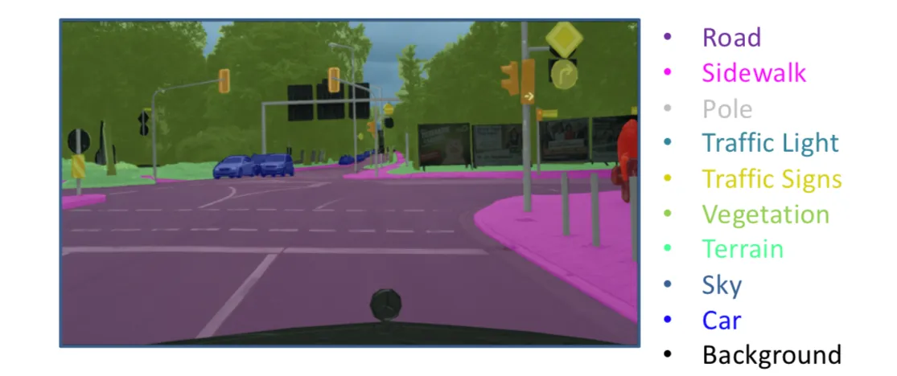

Segmentasi merupakan salah satu cara untuk membedakan antara objek satu dengan objek lainnya dalam suatu citra. Cara ini dapat dilakukan dengan mengelompokkan nilai pixel citra berdasarkan kedekatan warnanya.

Pada UTS kali ini, Anda diminta untuk melakukan segmentasi citra plat nomor kendaraan di Indonesia. Fungsi segmentasi dalam kasus ini adalah mempermudah pembacaan plat nomor kendaraan sebelum proses selanjutnya, seperti pembacaan karakter pada plat nomor.

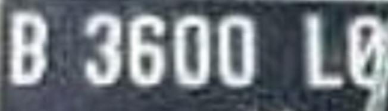

# Ketentuan UTS

Berdasarkan pemaparan kasus, Anda diminta untuk,

1. Pilih 5 citra plat nomor untuk setiap anggota kelompok dari dataset yang telah disediakan. 
2. Lakukan segmentasi pada citra plat nomor untuk memperjelas karakter pada plat nomor.
3. Anda dapat menggunakan algortima K-Means seperti yang telah dijelaskan pada praktikum sebelumnya atau menggunakan algoritma klasterisasi yang lain.
4. Anda diperkenankan untuk melakukan pra pengolahan data (preprocessing) pada citra seperti,
    * Merubah color space
    * Reduksi dimensi
    * dsb
5. Tampilkan perbandingan citra antara sebelum dan sesudah di segmentasi

**Open Challange (Opsional)**

Bagaimana cara melakukan evaluasi pada hasil segementasi?
Terapkan pada kasus ini!

**Catatan:**

Proses loading citra dicontohkan dengan menggunakan library openCV
Secara default, openCV akan memuat citra dalam format BGR

# Jawab

## Menampilkan Citra Plat Nomor

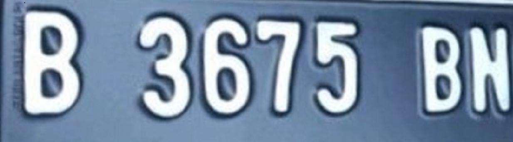
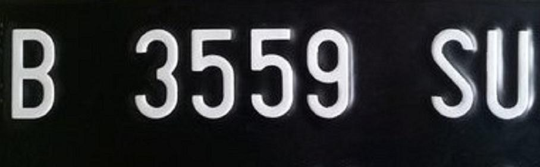
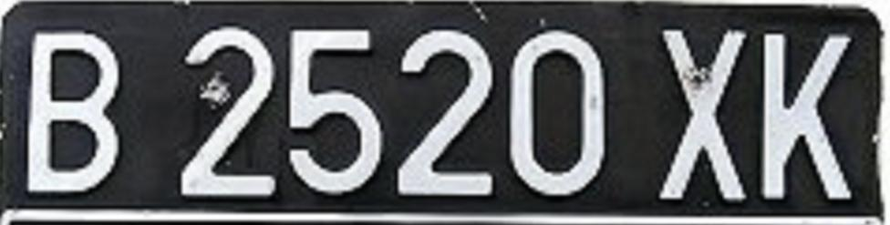

## Melihat Dimensi
Terlihat bahwa citra tersebut memiliki tinggi, lebar, dan 3 channel warna RGB. Dengan informasi ini, kita dapat mengetahui dimensi dasar dari setiap gambar. 

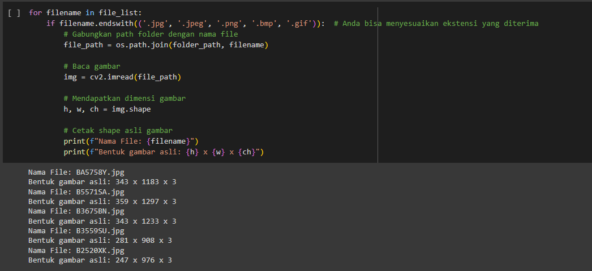

## Reshape
Setelah reshape, dimensi gambar berubah menjadi matriks dua dimensi. Dimensi gambar setelah direshape memiliki jumlah baris yang lebih besar dibandingkan dengan dimensi asli. Ini menunjukkan bahwa setiap piksel gambar sekarang dianggap sebagai satu baris dalam matriks 2D, yang lebih sesuai untuk algoritma K-Means.

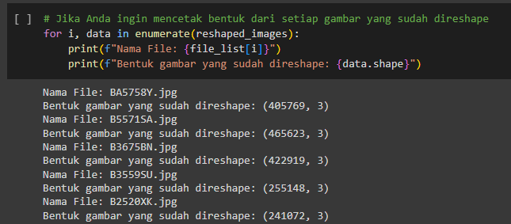

## Analisis Persebaran Warna Citra
Berikut adalah visualisasi sebaran warna dalam setiap gambar, dengan fungsi plot_pixels digunakan untuk membuat plot yang menunjukkan bagaimana warna terdistribusi dalam gambar.

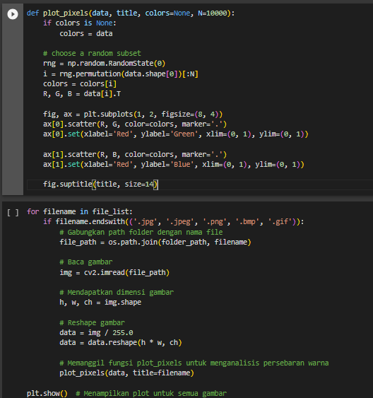
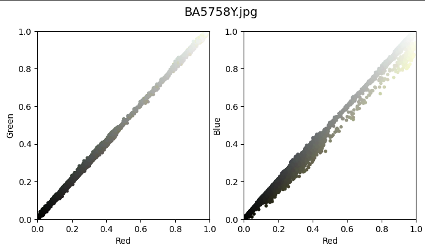
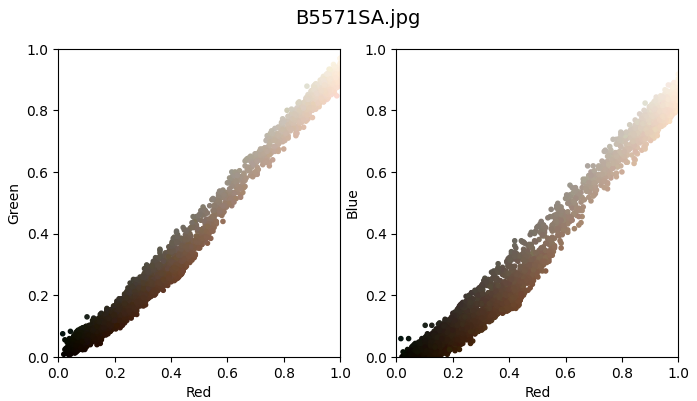
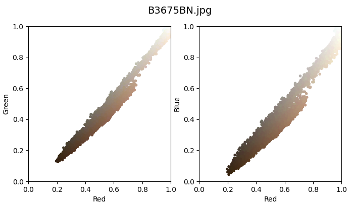
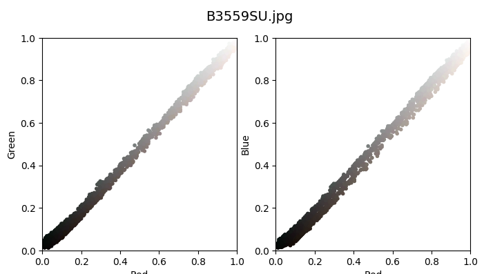
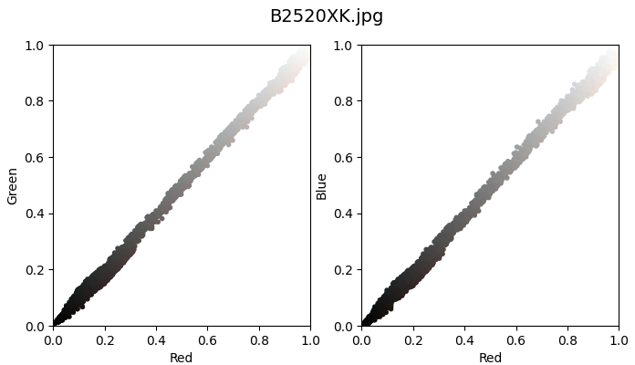

