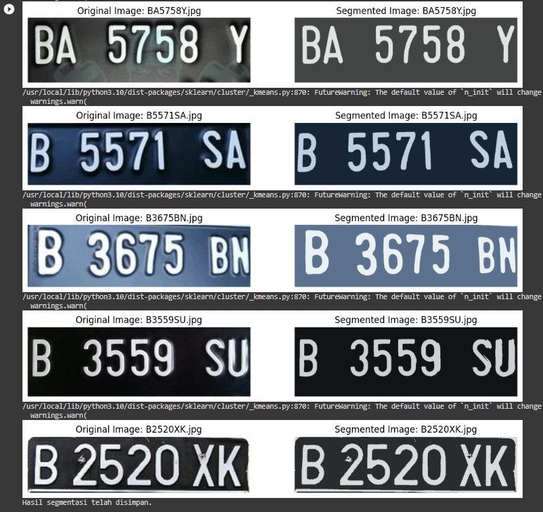
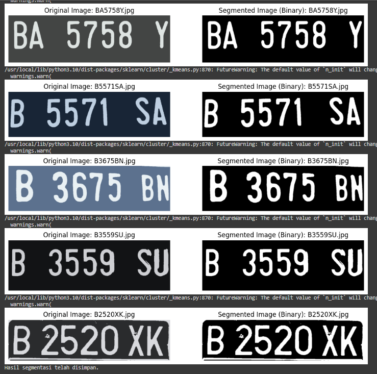
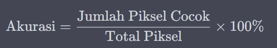
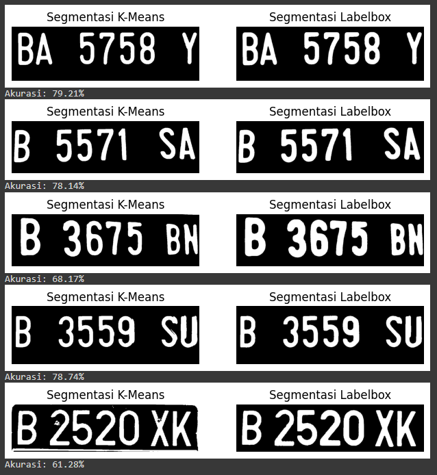
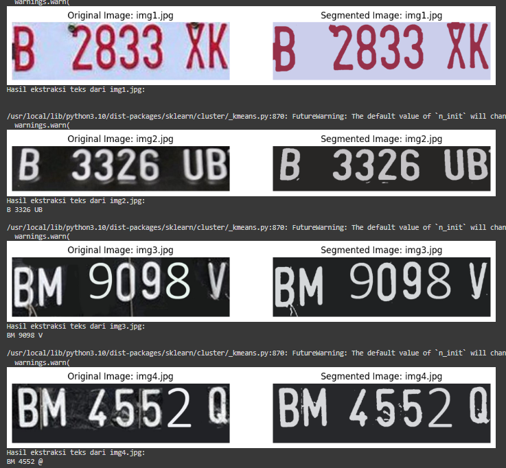
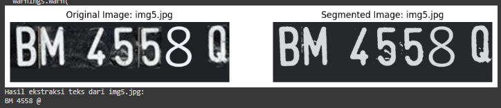

# UTS - Segmentasi Gambar dengan Clustering

Segmentasi merupakan salah satu cara untuk membedakan antara objek satu dengan objek lainnya dalam suatu citra. Cara ini dapat dilakukan dengan mengelompokkan nilai pixel citra berdasarkan kedekatan warnanya.

Pada UTS kali ini, Anda diminta untuk melakukan segmentasi citra plat nomor kendaraan di Indonesia. Fungsi segmentasi dalam kasus ini adalah mempermudah pembacaan plat nomor kendaraan sebelum proses selanjutnya, seperti pembacaan karakter pada plat nomor.

# Ketentuan UTS

Berdasarkan pemaparan kasus, Anda diminta untuk,

1. Pilih 5 citra plat nomor untuk setiap anggota kelompok dari dataset yang telah disediakan. 
2. Lakukan segmentasi pada citra plat nomor untuk memperjelas karakter pada plat nomor.
3. Anda dapat menggunakan algortima K-Means seperti yang telah dijelaskan pada praktikum sebelumnya atau menggunakan algoritma klasterisasi yang lain.
4. Anda diperkenankan untuk melakukan pra pengolahan data (preprocessing) pada citra seperti,
    * Merubah color space
    * Reduksi dimensi
    * dsb
5. Tampilkan perbandingan citra antara sebelum dan sesudah di segmentasi

**Open Challange (Opsional)**

- Bagaimana cara melakukan evaluasi pada hasil segementasi?
- Terapkan pada kasus ini!

**Catatan:**

Proses loading citra dicontohkan dengan menggunakan library openCV
Secara default, openCV akan memuat citra dalam format BGR

# Jawab

## Menampilkan Citra Plat Nomor

## Melihat Dimensi
Terlihat bahwa citra tersebut memiliki tinggi, lebar, dan 3 channel warna RGB. Dengan informasi ini, kita dapat mengetahui dimensi dasar dari setiap gambar. 

## Reshape
Setelah reshape, dimensi gambar berubah menjadi matriks dua dimensi. Dimensi gambar setelah direshape memiliki jumlah baris yang lebih besar dibandingkan dengan dimensi asli. Ini menunjukkan bahwa setiap piksel gambar sekarang dianggap sebagai satu baris dalam matriks 2D, yang lebih sesuai untuk algoritma K-Means.

## Analisis Persebaran Warna Citra
Berikut adalah visualisasi sebaran warna dalam setiap gambar, dengan fungsi plot_pixels digunakan untuk membuat plot yang menunjukkan bagaimana warna terdistribusi dalam gambar.

## Segmentasi Citra dengan Algoritma K-Means
Proses segmentasi menggunakan metode K-Means Clustering memerlukan jumlah cluster, dalam hal ini di set n_clusters=2, karena ingin membagi citra ke dalam dua kelompok warna dominan yang mewakili citra. 
- Selanjutnya model K-Means diinisialisasikan dengan jumlah cluster yang telah ditentukan, dan model akan memulai proses pengelompokan. 
- Kemudian model dilatih dengan data gambar yang sudah dilakukan preprocessing sebelumnya. Ini berarti model mencoba menemukan dua kelompok piksel yang mirip satu sama lain berdasarkan warna. Hasil dari proses ini adalah label cluster untuk setiap piksel dalam gambar, yang menunjukkan keanggotaan piksel ke dalam salah satu dari dua kelompok.
- Setelah pengelompokan selesai, model menghitung pusat dari masing-masing kluster (dalam hal ini, dua pusat kluster). Pusat kluster adalah nilai warna yang paling mewakili keseluruhan kelompok.
- Mengganti Warna Gambar Asli: Gambar asli diubah dengan cara menggantikan setiap piksel dengan warna dari salah satu pusat kluster sesuai dengan label cluster piksel tersebut. Hasilnya adalah gambar yang sudah disegmentasi menjadi dua kelompok warna.

## Konversi Biner
Konversi citra ke dalam biner dilakukan untuk mempermudah dan menyederhanakan analisis. Selain itu konversi hasil segmentasi ke dalam biner juga diperlukan untuk proses evaluasi.

## Evaluasi dengan Ground Truth (LabelBox)
Evaluasi hasil segmentasi dari K-Means Clustering dengan ground truth (GT) yang berasal dari Labelbox, yang dilakukan dengan membandingkan antara citra hasil segmentasi yang dihasilkan oleh K-Means Clustering dengan citra GT yang dianggap sebagai referensi yang benar. 
- Proses pembuatan Ground Truth (GT) dengan Labelbox melibatkan pengidentifikasian dan pelabelan objek pada gambar sehingga hasil label yang dihasilkan dapat dijadikan referensi yang benar atau "kebenaran" untuk tujuan evaluasi dalam tugas segmentasi objek atau pengenalan objek pada citra.
- Proses pembuatan GT pada LabelBox dilakukan dengan:
    - Mengunggah dataset
    - Mendefinisikan tugas labeling --> mengidentifikasi dan melabeli objek dengan membuat GT untuk segmentasi objek
    - Pengaturan labeling, pembagian tugas, proses labeling
    - Validasi dan koreksi
    - Ekspor data label
- Dalam studi kasus ini, kami menggunakan metrik evaluasi **akurasi** dalam mengukur sejauh mana citra hasil segmentasi K-Means cocok dengan citra hasil segmentasi Labelbox. Akurasi mengukur persentase piksel yang diklasifikasikan dengan benar dalam segmentasi dibandingkan dengan citra hasil segmentasi Labelbox. 
- Akurasi dihitung dengan cara menghitung jumlah piksel yang cocok (matching_pixels) dan membaginya dengan total piksel dalam gambar (total_pixels), kemudian dikalikan dengan 100 untuk menghasilkan persentase akurasi. Berikut ini adalah rumus untuk menghitung akurasi:

    

## Hasil Evaluasi dengan Ground Truth (LabelBox)

## Evaluasi dengan Pytesseract

